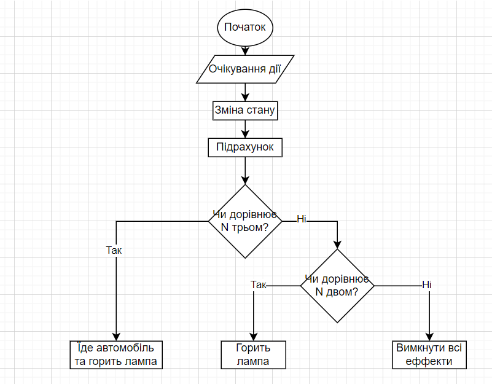

# Мої проєкти

На цій сторінці представлені ключові навчальні проєкти, над якими я працював під час навчання.

## Проєкт 1: Відео гра з вітряками
* **Опис**: Гра в якій ти натискає на вітряки,після цього вони починають працювати, їх три , якщо працює один вітряк то нічого не трапляється, якщо два, то горить лампа, якщо три, їде автомобіль
* **Технології**: HTML, CSS, JavaScript, Git.

### Алгоритм роботи проєкту
Нижче представлена блок-схема, що ілюструє логіку роботи системи:

